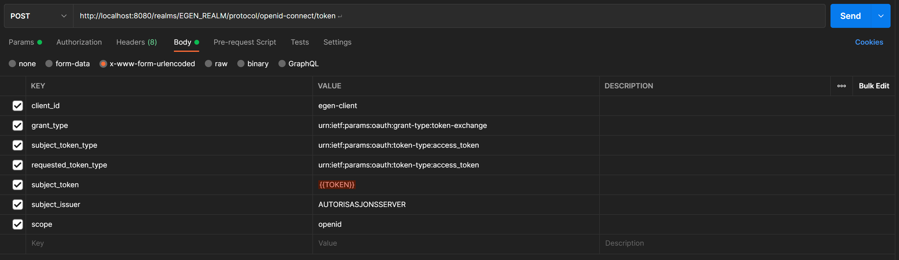

#Token Exchange

Token exchange er en oauth2 flyt som gjør det mulig å veksle inn et token utstedt av en autorisasjonsserver, inn i et token fra en annen autorisasjonsserver
Her går vi gjennom hvordan man kan sette opp denne flyten i Keycloak.

##Hvordan konfigurere opp Keycloak for Token Exchange

Keycloak bruker Quarkus for bygg og kjøring, og det ligger mer info inne i keycloak mappen, men under følger noen hovedpunkter.

###For å bygge keycloak for kjøring samt starte opp:

1. Last ned keycloak distribusjon: https://www.keycloak.org/downloads
2. Pakk ut zip eller tar.gz pakke
3. Åpne en terminal i keycloak mappen
4. Rediger kc.sh filen inne i /bin mappen. Fjern "--auto-build" fra følgende kode i script:
   * ``` 
      if [[ "$1" = "start-dev" ]]; then
      CONFIG_ARGS="$CONFIG_ARGS --profile=dev $1 --auto-dev" 
     ```
5. Kjør så følgende kommando ./bin/kc.sh build --features=admin-fine-grained-authz, token-exchange
6. Så for å starte opp keycloak for utvikling kan man kjøre følgende kommando: ./bin/kc.sh start-dev

###Første kjøring med oppsett for token exchange

1. Ved første kjøring av Keycloak opprett en admin bruker og gå til administration console.
2. Opprett et nytt Realm
3. I nytt realm opprett en ny client
4. Klikk deg inn på ny klient og gå til permission tabben.
5. Aktiver permissions og klikk deg inn på token-exchange
6. Lag en ny policy ved å klikke på dropdown listen hvor det står "Create policy" og velg typen Client
7. Kall denne target-client-exchange og velg klienten du opprettet i steg 3 som klient.
8. Gå så inn på Identity Providers og legg til ny provider, dette er autorisasjonsserveren du skal konvertere tokens fra
9. Etter opprettelsen av Identity Provider så kan du igjen klikke deg inn i Permission tabben her, og videre inn i token-exchange.
10. Her velger du da Policyen du laget i steg 6, altså target-client-exchange
11. Nå skal du kunne gjøre en token exchange, gjør følgende kall mot Keycloak:
    - 
    - client_id er klient du vil exchange token til
    - grant_type er hva du vil gjøre, altså token-exchange
    - subject_token_type er typen token du sender inn
    - requested_token_type er token typen du vil ha tilbake
    - subject_token er tokenet fra autorisasjonsserver
    - scope openId er nødvendig om id_token er ønsket
    
